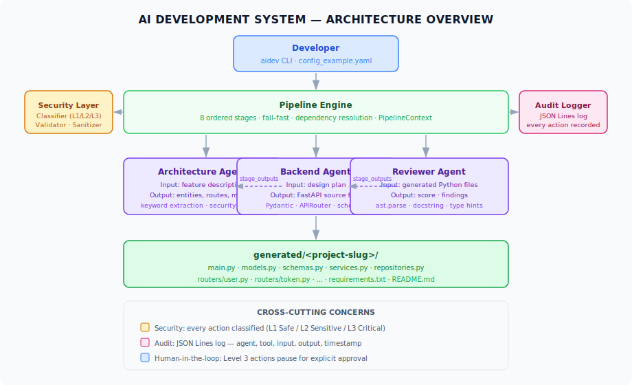
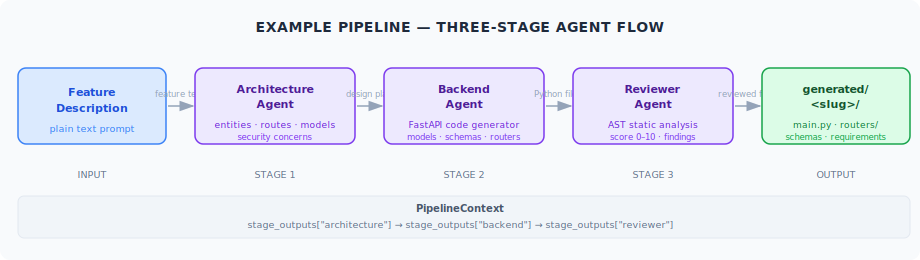
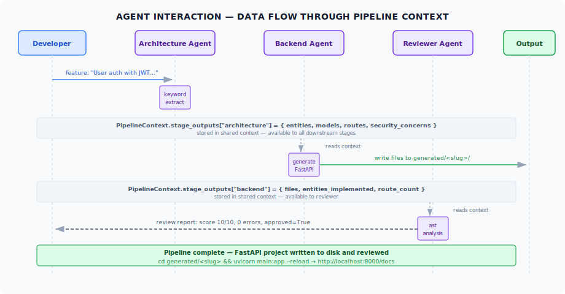
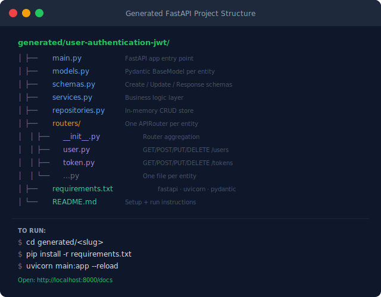

<p align="center">
  
</p>

<h1 align="center">AI Development System</h1>

<p align="center">
  <strong>A multi-agent Python framework that turns a plain-text feature description into a running FastAPI backend — automatically.</strong>
</p>

<p align="center">
  
  
  
  
  
  
</p>

---

## What it does

You type:

```
python -m examples.run_pipeline --feature "Order management with payments and invoices"
```

Three agents run in sequence. In under a second you have a `generated/order-management-with-payments-and-invoices/` folder with:

- `main.py` — FastAPI application entry point
- `models.py` — SQLAlchemy-style Pydantic models per entity
- `schemas.py` — Create / Update / Response schemas
- `services.py` — Business logic layer
- `repositories.py` — In-memory CRUD store
- `routers/order.py`, `routers/payment.py`, `routers/invoice.py` — One APIRouter per entity
- `requirements.txt` + `README.md`

Then run it:

```bash
cd generated/order-management-with-payments-and-invoices
pip install -r requirements.txt
uvicorn main:app --reload
# -> http://localhost:8000/docs
```

---

## How the pipeline works

<p align="center">
  
</p>

Three agents run in a strict sequence managed by the `PipelineEngine`:

| Stage | Agent | Input | Output |
|-------|-------|-------|--------|
| 1 | **ArchitectureAgent** | Feature description text | Entities, routes, security concerns |
| 2 | **BackendAgent** | Architecture plan | FastAPI source files on disk |
| 3 | **ReviewerAgent** | Generated `.py` files | Score 0–10, findings, approved flag |

All inter-agent data flows through a single `PipelineContext.stage_outputs` dictionary — no side-channels, no globals. Each stage reads from upstream keys set by previous stages.

---

## Agent interaction detail

<p align="center">
  
</p>

---

## Generated project structure

<p align="center">
  
</p>

---

## Quick start

```bash
# Clone and install
git clone <repo-url>
cd AI-Development-System-v1
pip install -e .

# Run the default example (JWT auth system)
python -m examples.run_pipeline

# Custom feature
python -m examples.run_pipeline --feature "Blog with posts, comments and tags"

# Show all generated source code inline
python -m examples.run_pipeline --feature "E-commerce product catalog" --show-code
```

Or via the `aidev` CLI:

```bash
aidev example run
aidev example run --feature "Inventory management with suppliers"
```

---

## Repository layout

```
src/
  agents/       BaseAgent, registry, orchestrator
  pipeline/     PipelineEngine + PipelineContext + Stage dataclasses
  security/     ActionClassifier (L1/L2/L3), InputValidator, PromptSanitizer
  audit/        AuditLogger — append-only JSON Lines
  generator/    ProjectGenerator — scaffolds new AI-native projects
  cli.py        aidev CLI entry point

examples/
  agents/       ArchitectureAgent, BackendAgent, ReviewerAgent (fully working)
  pipeline.py   build_example_pipeline() factory
  run_pipeline.py  Click CLI runner with Rich output

generated/      Output folder — one subdirectory per pipeline run
assets/images/  SVG diagrams for documentation
docs/           Architecture, pipeline, threat model, security rules
```

---

## CLI reference

```bash
aidev init <name>              # Scaffold a new AI-native project
aidev pipeline run             # Run the configured pipeline
aidev pipeline stages          # List pipeline stages
aidev agent list               # List all registered agents
aidev agent run <name>         # Run a specific agent
aidev audit show               # Print the audit log
aidev security classify <text> # Classify action level (L1/L2/L3)
aidev security check-prompt    # Check a prompt for injection patterns
aidev example run              # Run the 3-agent example pipeline
```

---

## Security model

Every agent action is classified before execution:

| Level | Name | Examples | Gate |
|-------|------|----------|------|
| L1 | Safe | read files, analyze code | auto-proceed |
| L2 | Sensitive | write files, modify data | log and proceed |
| L3 | Critical | deploys, permission changes, deletions | **human approval required** |

The `ActionClassifier`, `InputValidator`, and `PromptSanitizer` run on every input. All actions are written to an append-only JSON Lines audit log.

---

## Extending the system

**Add a new agent:**

```python
# examples/agents/my_agent.py
from src.agents.base import BaseAgent, AgentTask, AgentResult
from src.agents.registry import register

@register("my-agent")
class MyAgent(BaseAgent):
    name = "my-agent"
    allowed_tools = ["read_file", "write_file"]

    def execute(self, task: AgentTask) -> AgentResult:
        # your logic here
        return AgentResult(success=True, output={"result": "..."})
```

**Add a new pipeline stage:**

```python
from src.pipeline.engine import PipelineEngine, PipelineContext
from src.pipeline.stages import StageResult, StageStatus

def my_stage(context: PipelineContext) -> StageResult:
    upstream = context.stage_outputs.get("architecture", {})
    # process upstream data...
    return StageResult(stage_name="my-stage", status=StageStatus.PASSED, output={...})

engine.register_stage("my-stage", my_stage, depends_on=["architecture"])
```

---

## Roadmap

| Version | Focus | Status |
|---------|-------|--------|
| v1 | Documentation framework, threat model, security rules | Done |
| v2 | Working Python framework, 3 agents, FastAPI generation | **Current** |
| v3 | Real LLM integration (Claude API), streaming responses | Planned |
| v4 | Database backends, auth middleware, Docker output | Planned |
| v5 | Multi-repo orchestration, CI/CD generation | Planned |

---

## License

MIT

---

*Javier Morron — IA, automatizacion y proposito: ese es mi lenguaje.*
