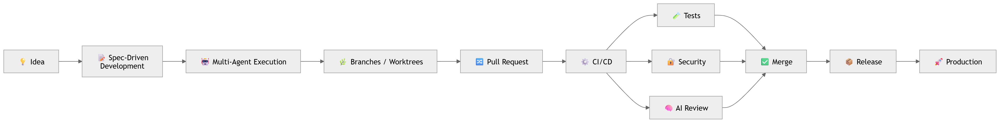

# AI Development System v2

### AI-Native Software Development Framework

## Architecture

The system follows a structured pipeline:

```
Human Direction → Specification → Threat Modeling → Security Rules
→ Agent Implementation → Automated Testing → AI Code Review
→ AI Security Review → Policy Validation → Pull Request → CI/CD
→ Deployment → Observability
```

> From **idea → specification → AI agents → production**

<p align="center">
  
</p>

---


---

## What Changed in v2

v1 was documentation-only. v2 adds a working Python framework:

| Component | What it does |
|-----------|-------------|
| `src/agents/` | BaseAgent, registry, orchestrator, and 5 built-in agent stubs |
| `src/pipeline/` | PipelineEngine running 8 ordered stages with fail-fast support |
| `src/security/` | Action classifier (Level 1/2/3), input validator, prompt sanitizer |
| `src/audit/` | Append-only JSON Lines audit logger — every action is recorded |
| `src/generator/` | Scaffolds new AI-native projects from templates |
| `src/cli.py` | `aidev` CLI — init, pipeline, agent, audit, security commands |

---

## Quick Start

**Install**

```bash
git clone https://github.com/javiermorron/AI-Development-System-v1.git
cd AI-Development-System-v1
pip install -e .
```

Or without installing:

```bash
pip install -r requirements.txt
python -m src.cli --help
```

**Create a new project**

```bash
aidev init my-project
```

**Run the pipeline**

```bash
aidev pipeline run --config config_example.yaml --project my-project
```

**List agents**

```bash
aidev agent list
```

**Check an action's security level**

```bash
aidev security classify deploy_to_production
# → Level 3 — Critical: requires human approval
```

**Show audit log**

```bash
aidev audit show --tail 50
```

---

## CLI Reference

```
aidev init <name>                        Scaffold a new AI-native project
aidev pipeline run [--config] [--project] Run the full pipeline
aidev pipeline stages [--config]         List configured stages
aidev agent list [--config]              Show registered agents
aidev agent run <agent> <task> [-i JSON] Run one agent task
aidev audit show [--tail N] [--agent X]  View audit log
aidev security classify <action>         Classify action level (1/2/3)
aidev security check-prompt <text>       Detect prompt injection
```

---

## Configuration

Copy `config_example.yaml` to `config.yaml` and customize. See inline comments.

Key sections:
- `agents.allowed_tools` — per-agent tool allowlist (least privilege)
- `agents.critical_actions` — actions requiring human approval
- `pipeline.stages` — ordered list of stages to run
- `audit.log_file` — path to JSON Lines audit log
- `security.prompt_injection_protection` — enable sanitizer

---

## Implementing Agents

Each agent in `src/agents/builtin.py` has a `TODO` marking where to add logic:

```python
@register
class BackendAgent(BaseAgent):
    name = "backend-agent"
    allowed_tools = ["read_file", "write_file", "run_tests"]

    def execute(self, task: AgentTask) -> Any:
        # TODO: call LLM API, parse response, return output
        ...
```

The base class handles input validation, tool authorization, and audit logging automatically.

---

## Security Model

All agent actions are classified before execution:

| Level | Type | Gate |
|-------|------|------|
| 1 — Safe | Read, analyze | None |
| 2 — Sensitive | Write, create, update | Logged automatically |
| 3 — Critical | Deploy, delete, financial | Human approval prompt |

See `docs/threat-model.md` and `docs/security-rules.md` for the full model.

---

## Documentation

- [Vision](docs/vision.md)
- [Architecture](docs/architecture.md)
- [Roadmap](docs/roadmap.md)
- [Threat Model](docs/threat-model.md)
- [Security Rules](docs/security-rules.md)

---

## Roadmap

**v2 (current)** — Working Python framework: CLI, agent stubs, pipeline engine, security helpers, audit logging, project generator.

**v3 — LLM Integration** — Connect agents to real LLM APIs (Anthropic, OpenAI, Ollama). Implement stage handlers (spec validation, test runner, security scanner). Multi-agent orchestration workflows.

**v4 — Autonomous Engineering** — Self-healing pipelines, AI architecture validation, automatic documentation sync, intelligent deployment strategies.

---

## Tech Stack

| Layer | Tools |
|-------|-------|
| AI Agents | Claude Code, Cursor |
| Framework | Python 3.10+, Click, Rich, PyYAML |
| Local Models | Ollama (planned v3) |
| Specs | Markdown |
| Version Control | Git |
| CI/CD | GitHub Actions |
| Security | Classifier + Sanitizer (built-in), Bandit/Semgrep (planned v3) |
| Release | Release Please (planned v3) |

---

## Author

**Javier Morrón** — AI Engineer, Automation & AI Systems Architect

> IA, automatización y propósito: ese es mi lenguaje.

[LinkedIn](https://www.linkedin.com/in/javiermorron)

---

## License

MIT — see [LICENSE](LICENSE)
