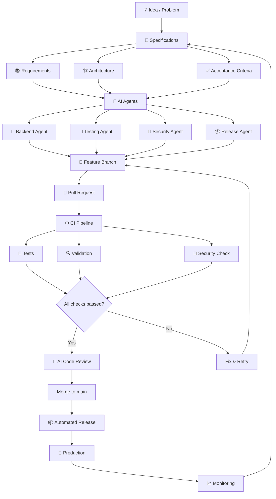

# 🧠 AI Development System v1
### AI-Native Software Development Framework

> From **idea → specification → AI agents → production**

<p align="center">
  
</p>

---


---

# ⭐ Why This Project Matters

AI coding tools are rapidly changing how software is built.

However, most AI-generated code today suffers from major problems:

- lack of architecture
- missing tests
- security risks
- inconsistent development workflows
- difficult maintenance

AI Development System v1 addresses these issues by introducing a **structured AI-native development workflow**.

Instead of writing code directly, engineers define:

- system architecture
- specifications
- validation rules

AI agents then implement the system while automated pipelines ensure:

- reliability
- security
- maintainability
- production readiness

The goal is to move software development from: idea → code 
to a more robust model: idea → specifications → AI agents → validation → production.


# 🚀 Overview

**AI Development System v1** is a framework designed to build software using **AI-first development principles**.

# ⚡ Quick Start

Clone the repository

```bash
git clone https://github.com/javiermorron/AI-Development-System-v1.git
cd AI-Development-System-v1
```

Explore the documentation in the `docs/` folder to understand the system architecture, development philosophy, and implementation details.

# 📚 Documentation

- [Vision](docs/vision.md)
- [Architecture](docs/architecture.md)
- [Roadmap](docs/roadmap.md)


Instead of writing code manually, the system orchestrates:

- 🤖 AI agents  
- 📝 structured specifications  
- 🧪 automated testing  
- 🔍 AI code reviews  
- 🔐 security checks  
- ⚙️ CI/CD pipelines  

to transform ideas into **production-ready software**.

---

# 🌍 Vision

Software development is changing.

The developer is no longer just a coder.

The developer becomes:

```
Architect

Orchestrator

Validator

System Designer

```


AI writes code.

Humans design reliable systems.

---

# 🧩 System Architecture

AI Development System v1 transforms development into a structured workflow.



---

# 🧠 Development Philosophy

### 1️⃣ AI accelerates development
But responsibility remains human.

### 2️⃣ Code without tests is technical debt
Especially when generated by AI.

### 3️⃣ Architecture > Code
The system design matters more than the implementation.

### 4️⃣ Everything must be validated automatically
Manual validation cannot keep up with AI speed.

### 5️⃣ Production-ready software is the goal
Not just generated code.

---

# 🧬 Core Components

## 👨‍💻 Human Direction

The developer defines:

- system goals
- architecture
- constraints
- acceptance criteria

AI executes tasks.

Humans **make decisions**.

---

## 📜 Specifications (Spec-Driven Development)

All development starts with structured specifications.

```
docs/
 ├ vision.md
 ├ roadmap.md
 ├ requirements.md
 ├ architecture.md
 ├ tasks.md
 ├ qa-checklist.md
 └ release-rules.md
```

These documents act as the **source of truth** for AI agents.

---

## 🤖 AI Implementation Agents

Multiple agents collaborate to build the system.

Example agents:

```
backend-agent
frontend-agent
testing-agent
docs-agent
security-agent
release-agent
```

Each agent works in its own branch.

```
main
feature/auth
feature/dashboard
feature/tests
feature/docs
```

---

## 🧪 Automated Testing

AI-generated code must include tests.

### 🔴 Critical tests
- authentication
- core business logic
- APIs
- database operations
- integrations

### 🟡 Important tests
- edge cases
- complex generated code

### 🟢 Delegated tests
- helpers
- simple utilities

---

## 🔀 Pull Request Workflow

No direct commits to `main`.

Development flow:

```
feature branch
↓
implementation
↓
pull request
↓
CI checks
↓
review
↓
merge
```

Each PR automatically runs:

- lint
- tests
- security checks
- build validation

---

## ⚙️ CI/CD Pipeline

CI/CD ensures code quality and safe deployment.

### Continuous Integration

Every commit triggers:

```
install dependencies
run linter
run tests
build
```

If anything fails → merge blocked.

---

### Continuous Deployment

If all checks pass:

```
deploy automatically
```

`main` must always be **production-ready**.

---

# 🤖 AI Code Review

Every Pull Request can be reviewed automatically by AI agents.

The agent checks:

- architecture consistency
- performance issues
- missing tests
- logic errors
- best practices

Possible tools:

- CodeRabbit
- GitHub Copilot
- Cursor
- Claude

---

# 🔐 Security Review

Security must be verified automatically.

Checks include:

```
SQL injection
XSS vulnerabilities
exposed secrets
weak authentication
unsafe dependencies
```

Example tool:

```
claude-code-security-review
```

---

# 📦 Automated Releases

Versioning is automated.

Workflow:

```
merge into main
↓
release PR
↓
version bump
↓
tag
↓
release notes
↓
deploy
```

Release notes can be generated using AI.

---

# 🔄 Full Development Flow

```
Idea
↓
Specification
↓
Tasks
↓
AI Agents implement
↓
Tests generated
↓
Pull Request
↓
CI/CD
↓
AI Review
↓
Security Check
↓
Merge
↓
Release
↓
Production
```

---

# 🛠 Example Tech Stack

Possible tools used in this system:

| Layer | Tools |
|-----|-----|
| AI Agents | Claude Code, Cursor |
| Local Models | Ollama |
| Specs | Markdown |
| Version Control | Git |
| CI/CD | GitHub Actions |
| Security | Claude Security Review |
| Release | Release Please |

---

# 🎯 Goals

This system enables developers to build software that is:

```
faster
safer
scalable
maintainable
AI-native
```

---

# 🧭 Future Versions

Upcoming improvements:

- autonomous agent orchestration
- AI architecture validation
- automatic documentation generation
- self-healing CI/CD pipelines
- intelligent deployment strategies

---

# 👨‍🚀 Author

**Javier Morrón**

AI Engineer  
Automation & AI Systems Architect

> IA, automatización y propósito: ese es mi lenguaje.

---

# 🔗 Connect

LinkedIn  
https://www.linkedin.com/in/javiermorron

---

# 📜 License

This project is licensed under the **MIT License**.

See the full license here:

[LICENSE](LICENSE)
